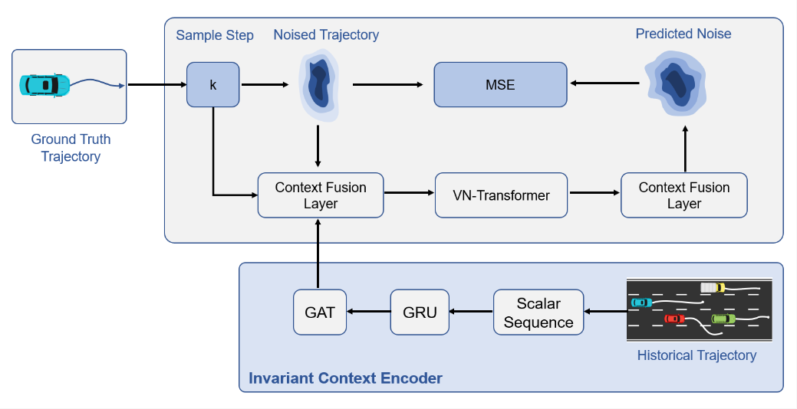

# EquiDiff
Code for Paper "EquiDiff: A Conditional Equivariant Diffusion Model For Trajectory Prediction". Paper can be accessed here [IEEE Version](https://ieeexplore.ieee.org/abstract/document/10421892) or [Arxiv Version](https://arxiv.org/pdf/2308.06564.pdf).

Run "main.py" for training and evaluation. The dataset can be acquired from https://github.com/Haoran-SONG/PiP-Planning-informed-Prediction. Please be aware that the primary drawback of EquiDiff lies in its high computational complexity, primarily attributable to the equivaraiant attention mechanism. Consequently, utilizing the entire dataset may result in significantly prolonged training times. Therefore, we suggest running the model with smaller-sized datasets to mitigate this issue.

### Cite the paper as follows:

    @inproceedings{chen2023equidiff,
      title={Equidiff: A conditional equivariant diffusion model for trajectory prediction},
      author={Chen, Kehua and Chen, Xianda and Yu, Zihan and Zhu, Meixin and Yang, Hai},
      booktitle={2023 IEEE 26th International Conference on Intelligent Transportation Systems (ITSC)},
      pages={746--751},
      year={2023},
      organization={IEEE}
    }
